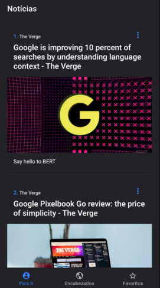

## Notas del curso Udemy -> ionic 5: Crear aplicaciones IOS, Android y PWAs con Angular

https://www.udemy.com/course/ionic-ios-android-pwa-appstore-playstore-push/

### Directorios

Encontramos 3 directorios principales

1. Carpeta principal del repositorio: Se encuentran las notas de todas las secciones
2. Ejemplos ionic: Están todos los proyectos desarrollados durante el curso
3. Material: Todos los materiales utilizados durante el curso (numerados por sección)

### Secciones

- 7 - Aplicación noticias
  - [Notas](<./07.App noticias.md>)
  - [Proyecto](<./Ejemplos ionic/04-noticias>)

