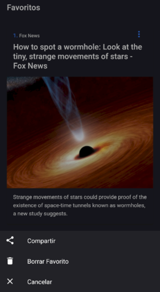
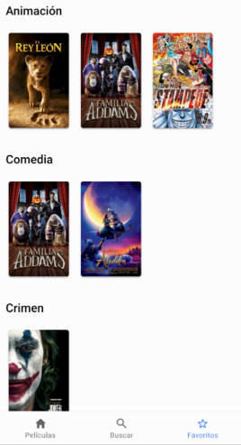

## Notas del curso Udemy -> ionic 5: Crear aplicaciones IOS, Android y PWAs con Angular

https://www.udemy.com/course/ionic-ios-android-pwa-appstore-playstore-push/

### Directorios

Encontramos 3 directorios principales

1. Carpeta principal del repositorio: Se encuentran las notas de todas las secciones
2. Ejemplos ionic: Están todos los proyectos desarrollados durante el curso
3. Material: Todos los materiales utilizados durante el curso (numerados por sección)

### Secciones

- 2 - ¿Qué es Ionic?
  - [Notas](./02.&#32;Qué&#32;es&#32;ionic.md)

- 3 - Refuerzo de Angular
  - [Notas](./03.&#32;Refuerzo&#32;Angular.md)
  
- 4 - Ionic
  - [Notas](./04.&#32;Ionic.md)

- 5 - Componentes de Ionic
  - [Notas](./05.&#32;Componentes&#32;de&#32;ionic.md)
  
- 6 - Lanzar apps en dispositivos fisicos y emulados
  - [Notas](./06.&#32;Lanzar&#32;apps&#32;en&#32;dispositivos&#32;fisicos&#32;y&#32;emulados.md)

- 7 - Aplicación noticias
  - [Notas](./07.&#32;App&#32;noticias.md)
  - [Proyecto](./Ejemplos&#32;ionic/04-noticias)
  - [Live Demo](https://ionic-noticias-f8fc4.web.app/tabs/tab1) -> Abrir desde dispositivo movil o desktop como vista movil;

- 8 - Publicar app como PWA
  - [Notas](./08.&#32;Publicar&#32;app&#32;como&#32;PWA.md)

- 9 - Aplicación películas
  - [Notas](./09.&#32;App&#32;peliculas.md)
  - [Proyecto](./Ejemplos&#32;ionic/05-peliculasApp)
  - [Live Demo](https://ionic-peliculas-7e5c8.firebaseapp.com/tabs/tab1) -> Abrir desde dispositivo movil o desktop como vista movil;

